# Daily News

AI-curated daily tech news briefings. Scrapes HN, RSS, Telegram, GitHub — scores with Groq (`llama-3.1-8b-instant`) — publishes to GitHub Pages.

**Live site:** [pantha704.github.io/daily-news/](https://pantha704.github.io/daily-news/)

[](https://github.com/pantha704/daily-news/actions/workflows/daily-summary.yml)

## Architecture

```mermaid
flowchart LR
    click["👤 Click ↻ Refresh"] --> worker["☁️ Cloudflare Worker<br/>daily-news-refresh"]
    worker -->|"POST with GH_TOKEN"| api["🐙 GitHub API<br/>workflow_dispatch"]
    api --> actions["⚡ GitHub Actions<br/>daily-summary.yml"]
    actions --> checkout["📦 Checkout code"]
    checkout --> deps["📥 uv sync"]
    deps --> horizon["🤖 uv run horizon"]
    horizon --> scrape["📡 Scrape HN / RSS / Telegram / GitHub"]
    scrape --> score["🎯 Groq AI Score &amp; Filter<br/>(≥5.0 threshold)"]
    score --> enrich["🔍 Enrich + summarize"]
    enrich --> write["📝 Write EN+ZH .md → daily/_posts/"]
    write --> deploy["🚀 peaceiris/actions-gh-pages<br/>→ gh-pages branch"]
    deploy --> pages["🏗️ GitHub Pages Jekyll build"]
    pages --> site["🌍 pantha704.github.io/daily-news/"]
```



### Trigger paths

| Method | How |
|--------|-----|
| **Daily cron** | `0 6 * * *` — auto-runs every day at 06:00 UTC |
| **Manual** | Click "↻ Refresh (today)" on the site → Cloudflare Worker → GitHub API |
| **Manual (CLI)** | `gh workflow run daily-summary.yml --ref main` |

The Cloudflare Worker (`daily-news-refresh.pantha704.workers.dev`) is a 1KB stateless proxy. Its only job: hide the `GH_TOKEN` so the site button works without a browser prompt. Zero cost on free tier.

## Repo structure

```
.
├── code/              # Horizon app (Python)
│   ├── src/           # scrapers, AI scoring, orchestrator
│   ├── data/          # config.json, summaries
│   └── .github/       # GitHub Actions workflow
├── daily/             # Jekyll site → GitHub Pages
│   ├── _posts/        # generated EN+ZH summaries
│   ├── index.md       # homepage template
│   └── _config.yml    # Jekyll config
└── README.md
```

## Configuration

Key settings in [`code/data/config.json`](code/data/config.json):

- **Provider:** Groq (`llama-3.1-8b-instant`, free tier)
- **Threshold:** `ai_score_threshold: 5.0` — items scored ≥5 are included
- **Concurrency:** 1 (throttled to avoid Groq rate limits)
- **Languages:** `en`, `zh`
- **Sources:** Hacker News (30 stories, min 150 pts), RSS (2 feeds), Telegram (1 channel), GitHub (karpathy events + 3 repos)

## Site features

- **One-click refresh** — "↻ Refresh (today)" button calls Cloudflare Worker → triggers pipeline
- **EN/中文 toggle** — language switcher on article pages
- **Card-style digest list** — date + description per day
- **RSS feeds** — `/feed.xml`, `/feed-en.xml`, `/feed-zh.xml`

## How Horizon works

1. **Fetch** — Pull latest from HN, RSS, Telegram, GitHub concurrently
2. **Deduplicate** — Merge same story across sources
3. **Score & filter** — Groq scores 0-10, keep ≥5.0
4. **Enrich** — Web research for context + community comments
5. **Summarize** — Structured Markdown with tags, references, discussion
6. **Deliver** — Copy to `daily/_posts/`, deploy to GitHub Pages

## Quick Start

```bash
git clone https://github.com/pantha704/daily-news.git
cd daily-news
uv sync
# Add GROQ_API_KEY to .env, edit data/config.json
uv run horizon
```

## License

[MIT](LICENSE)
